# 03 - Real-time Infrastructure & Notification System

## 1. Architecture Overview

The real-time infrastructure provides the backbone for live messaging, presence, notifications, and search. It sits between the client application layer and the persistence/storage layer, managing connection state, message routing, and delivery guarantees.

### 1.1 High-Level Architecture

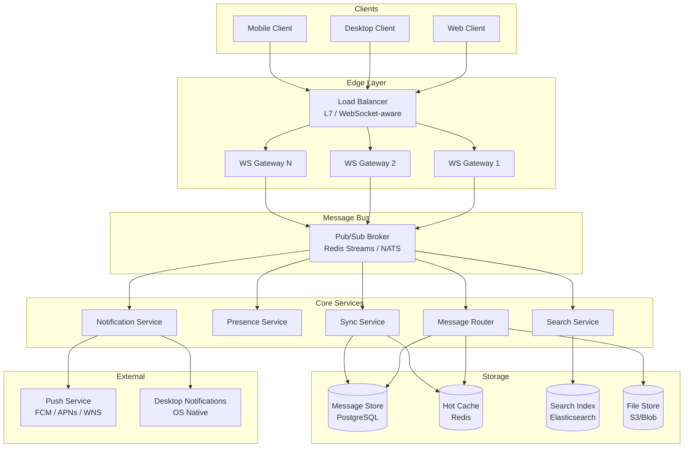

### 1.2 Component Responsibilities

| Component | Responsibility |
|-----------|---------------|
| WS Gateway | Terminates WebSocket connections, authenticates, routes frames to/from pub/sub |
| Message Router | Receives messages, persists, fans out to recipients via pub/sub topics |
| Presence Service | Tracks online/offline/away/DND status, broadcasts changes |
| Notification Service | Manages unread counts, badge state, push delivery, DND rules |
| Search Service | Indexes messages and metadata, serves search queries |
| Sync Service | Handles reconnection gap-fill, offline cache invalidation, conflict resolution |
| Pub/Sub Broker | Decouples producers from consumers, enables horizontal scaling |

---

## 2. WebSocket Protocol Design

### 2.1 Connection Lifecycle

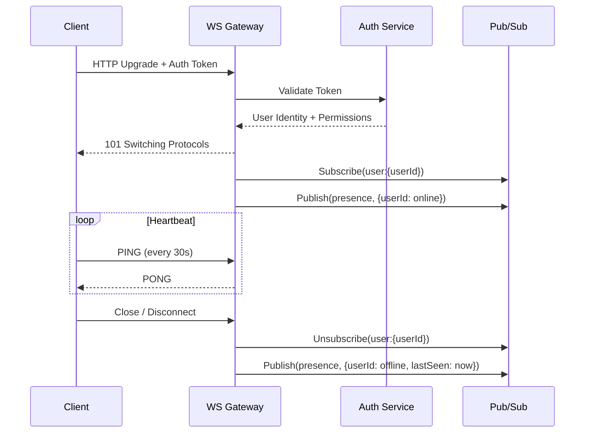

### 2.2 Frame Format

All WebSocket frames use JSON. Binary frames are reserved for file transfer (future).

```typescript
interface WSFrame {
  type: string;        // Message type discriminator
  id: string;          // Client-generated UUID for correlation
  timestamp: string;   // ISO 8601
  payload: object;     // Type-specific data
}
```

### 2.3 Message Types (Client -> Server)

| Type | Payload | Description |
|------|---------|-------------|
| `message.send` | `{ chatId, content, replyTo?, attachments? }` | Send a new message |
| `message.edit` | `{ messageId, content }` | Edit an existing message |
| `message.delete` | `{ messageId }` | Delete a message |
| `message.react` | `{ messageId, emoji, action: "add"\|"remove" }` | Add/remove reaction |
| `typing.start` | `{ chatId }` | User started typing |
| `typing.stop` | `{ chatId }` | User stopped typing |
| `read.mark` | `{ chatId, messageId }` | Mark messages as read up to messageId |
| `presence.update` | `{ status: "available"\|"away"\|"dnd"\|"offline" }` | Update presence |
| `sync.request` | `{ chatId, lastMessageId, limit? }` | Request missed messages |
| `search.query` | `{ query, scope?, filters?, cursor? }` | Execute search |

### 2.4 Message Types (Server -> Client)

| Type | Payload | Description |
|------|---------|-------------|
| `message.new` | `{ chatId, message }` | New message in a subscribed chat |
| `message.updated` | `{ chatId, message }` | Message was edited |
| `message.deleted` | `{ chatId, messageId }` | Message was deleted |
| `message.reaction` | `{ chatId, messageId, reactions }` | Reaction updated |
| `typing.indicator` | `{ chatId, userId, displayName, active }` | Typing state change |
| `read.receipt` | `{ chatId, userId, messageId }` | Read receipt from another user |
| `presence.changed` | `{ userId, status, lastSeen? }` | Contact presence changed |
| `notification.badge` | `{ chatId, unreadCount, mentionCount }` | Badge count update |
| `notification.toast` | `{ title, body, chatId, messageId, priority }` | Toast notification |
| `sync.response` | `{ chatId, messages[], hasMore, cursor }` | Gap-fill response |
| `search.results` | `{ results[], total, cursor }` | Search results |
| `ack` | `{ refId, status: "ok"\|"error", error? }` | Acknowledgment of client frame |
| `error` | `{ code, message, refId? }` | Error notification |

### 2.5 Delivery Guarantees

**At-least-once delivery** is the baseline. Exactly-once semantics at the application layer via idempotency.

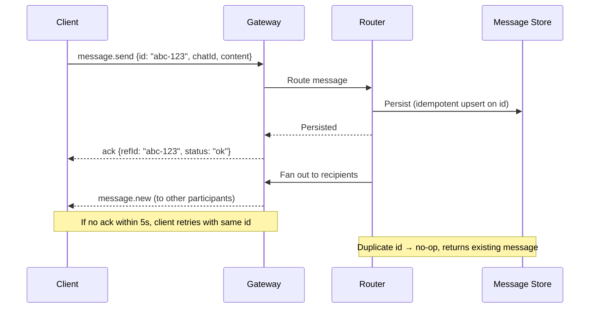

**Ordering guarantees:**
- Messages within a single chat are ordered by server-assigned sequence number (`seq`)
- Each chat maintains a monotonically increasing sequence counter
- Clients render messages ordered by `seq`, not by client timestamp
- Out-of-order delivery is possible; clients buffer and reorder

**Idempotency:**
- Every client message includes a UUID `id`
- Server deduplicates on `(chatId, id)` with a 24-hour TTL window
- Retries with the same `id` return the original `ack` without re-processing

### 2.6 Connection Management

| Parameter | Value | Rationale |
|-----------|-------|-----------|
| Heartbeat interval | 30 seconds | Balance between detection speed and overhead |
| Heartbeat timeout | 90 seconds (3 missed) | Tolerate brief network blips |
| Reconnect backoff | 1s, 2s, 4s, 8s, 16s, 30s (max) | Exponential with jitter |
| Max frame size | 64 KB | Prevents abuse; large content uses chunked upload |
| Connection idle timeout | 5 minutes (server) | Reclaim resources for idle connections |
| Max connections per user | 5 | Desktop + mobile + web + 2 extra sessions |

### 2.7 Authentication & Authorization

- Initial connection requires a valid JWT or session token in the `Authorization` header or as a query parameter (`?token=...`)
- Token refresh happens over a separate HTTP endpoint; the WS connection receives a `token.refresh` server frame when the token is about to expire
- Gateway validates that the user has access to each chat before processing `message.send` or `read.mark` frames
- Rate limiting: 10 messages/second per user, 1 typing indicator/second per chat

---

## 3. Notification System Design

### 3.1 Notification Architecture

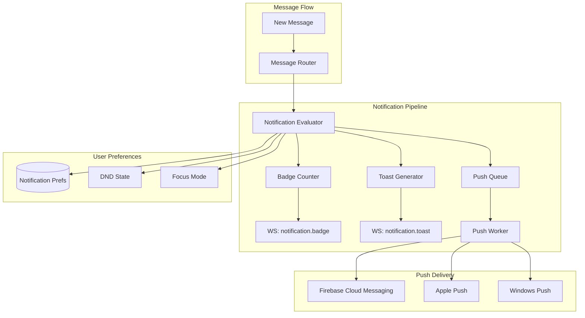

### 3.2 Notification Evaluator Logic

When a new message arrives, the evaluator determines what notifications to generate for each recipient:

```
for each recipient in chat.members (excluding sender):
    prefs = get_notification_preferences(recipient, chat)

    if recipient.status == DND:
        if message.priority != URGENT:
            skip toast/push, still update badge
            continue

    match prefs.level:
        case "all":
            generate toast + push + badge
        case "mentions_only":
            if recipient mentioned in message:
                generate toast + push + badge
            else:
                badge only
        case "off":
            badge only (silent)

    if recipient is online (WS connected):
        send via WS (badge + toast frames)
        skip push notification
    else:
        queue push notification
        update badge in store (for next login)
```

### 3.3 Badge / Unread Count System

Unread counts are tracked per-user, per-chat:

```typescript
interface UnreadState {
  chatId: string;
  userId: string;
  unreadCount: number;      // Total unread messages
  mentionCount: number;     // Unread @mentions
  lastReadMessageId: string; // Watermark
  lastReadSeq: number;       // Sequence number watermark
}
```

**Storage:** Redis hash per user for fast reads, persisted to DB on disconnect or periodically.

**Update flow:**
1. New message arrives -> increment `unreadCount` for all members except sender (and except members who have the chat currently focused)
2. If message contains `@mention` -> increment `mentionCount`
3. Client sends `read.mark` -> set watermark, recalculate counts from watermark
4. Push `notification.badge` frame to all connected sessions of the user

**Aggregation for sidebar:**
- Total unread across all chats -> shown as badge on "Chat" nav icon (e.g., "30")
- Per-chat unread -> shown next to each chat in sidebar (e.g., "1", "5")
- Mention indicator -> bold or distinct badge style

### 3.4 Toast / In-App Notifications

```typescript
interface ToastNotification {
  id: string;
  title: string;           // Sender name or channel name
  body: string;            // Message preview (truncated to 100 chars)
  chatId: string;          // For navigation on click
  messageId: string;       // For scrolling to message
  priority: "normal" | "urgent";
  timestamp: string;
  actions: ToastAction[];  // "Reply", "Mark as Read", "Mute"
}
```

**Display rules:**
- Show for max 5 seconds, then auto-dismiss
- Stack up to 3 toasts; queue additional
- If the user has the source chat focused, suppress the toast (badge still updates)
- Group rapid messages from same chat into a single toast ("3 new messages in #general")

### 3.5 Desktop / OS Notifications

When the app window is not focused or the user is away:

| Platform | Technology | Capabilities |
|----------|-----------|--------------|
| Windows | WNS + native toast API | Rich toast with actions, badge on taskbar |
| macOS | APNs + NSUserNotification | Banner/alert, badge on dock icon |
| Linux | libnotify / D-Bus | Basic notification with icon |
| Web | Web Notifications API | Permission-gated, basic toast |

**DND Integration:**
- Detect OS-level DND/Focus mode via platform APIs
- Show a banner: "Windows Do Not Disturb is on. You may miss notifications."
- Allow override for urgent/priority messages
- User can set DND within the app independently of OS

### 3.6 Notification Preferences Schema

```typescript
interface NotificationPreferences {
  // Global defaults
  global: {
    desktop: boolean;         // Show desktop notifications
    sound: boolean;           // Play notification sound
    dndSchedule?: {           // Scheduled DND
      enabled: boolean;
      startTime: string;      // "22:00"
      endTime: string;        // "08:00"
      timezone: string;
    };
  };

  // Per-chat overrides
  chatOverrides: Map<string, {
    level: "all" | "mentions_only" | "off";
    sound: boolean;
    pinned: boolean;          // Pin to top of chat list
  }>;

  // Per-channel overrides (same as chat)
  channelOverrides: Map<string, {
    level: "all" | "mentions_only" | "off";
    sound: boolean;
  }>;
}
```

### 3.7 Priority & Urgent Notifications

Urgent messages bypass DND and mute settings:

- Sender marks a message as `priority: "urgent"`
- Rate-limited: max 3 urgent messages per user per hour
- Recipients always receive toast + push, even if DND is active
- Visual distinction: red banner, persistent until dismissed
- Audit logged (to prevent abuse)

---

## 4. Presence System

### 4.1 Presence States

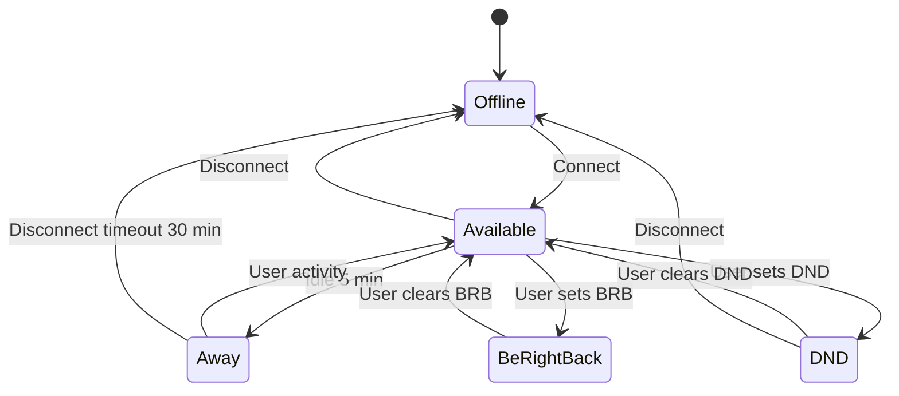

| Status | Icon | Description |
|--------|------|-------------|
| Available | Green dot | Actively connected, recent activity |
| Away | Yellow dot | Connected but idle > 5 minutes |
| Do Not Disturb | Red dot (dash) | Suppress non-urgent notifications |
| Be Right Back | Yellow clock | Temporarily away |
| Offline | Gray dot | No active connections |
| In a Meeting | Red dot | Calendar-synced (optional) |

### 4.2 Presence Propagation

Presence updates are expensive to fan out (every user's contacts need the update). Strategy:

1. **Lazy propagation**: Only send presence updates to users who have the contact visible (open chat, contact list on screen)
2. **Subscription model**: Client subscribes to presence for visible contacts only
3. **Batch updates**: Aggregate presence changes over 2-second windows before broadcasting
4. **TTL**: Presence subscriptions expire after 10 minutes; client re-subscribes on navigation

```typescript
// Client subscribes to presence for contacts currently visible
{ type: "presence.subscribe", payload: { userIds: ["u1", "u2", "u3"] } }

// Server pushes presence changes only for subscribed users
{ type: "presence.changed", payload: { userId: "u1", status: "away", lastSeen: "..." } }

// Client unsubscribes when navigating away
{ type: "presence.unsubscribe", payload: { userIds: ["u1", "u2"] } }
```

### 4.3 Typing Indicators

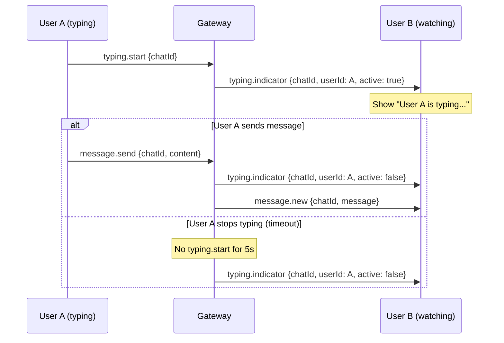

**Rules:**
- Client sends `typing.start` on first keystroke, then every 3 seconds while still typing
- Server auto-expires typing state after 5 seconds of no `typing.start`
- Display: "Alice is typing..." (1 person), "Alice and Bob are typing..." (2), "Several people are typing..." (3+)
- Rate limit: 1 `typing.start` per second per user per chat
- Typing indicators are ephemeral -- never persisted

### 4.4 Read Receipts

```typescript
// Client marks chat as read
{ type: "read.mark", payload: { chatId: "c1", messageId: "m42" } }

// Server broadcasts to other participants
{ type: "read.receipt", payload: { chatId: "c1", userId: "u1", messageId: "m42" } }
```

**Storage:** Per-user watermark per chat (last read `messageId` / `seq`). Not per-message.

**Display:**
- 1:1 chats: Show read/delivered checkmarks on messages (single check = delivered, double = read)
- Group chats: "Seen by 5" expandable list on hover
- Sent read receipts are batched: client sends `read.mark` at most once per second (on the latest visible message)

---

## 5. Search Architecture

### 5.1 Search Components

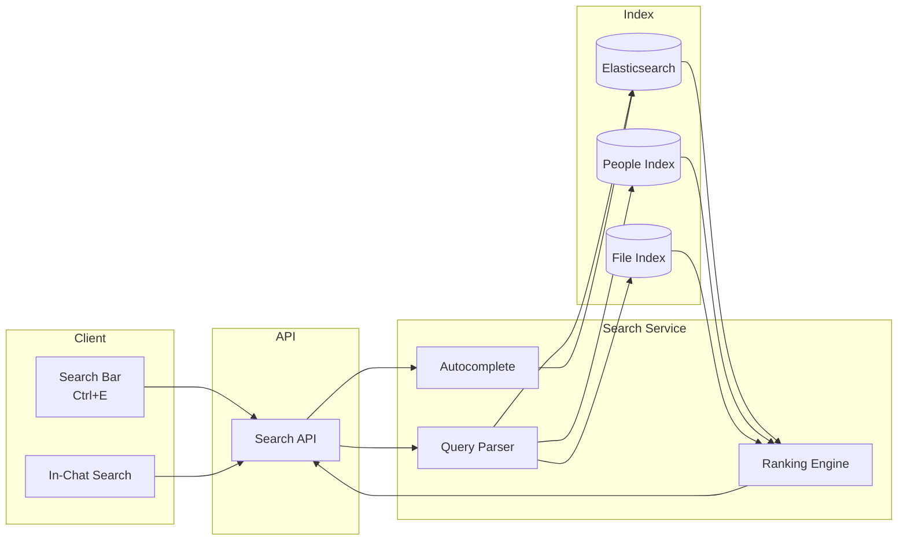

### 5.2 Search Scopes

| Scope | Trigger | Searches | Example |
|-------|---------|----------|---------|
| Global | Ctrl+E / search bar | Messages, people, files, channels | "quarterly report" |
| Chat | In-chat search icon | Messages within specific chat | "meeting notes" in chat with Alice |
| People | @mention autocomplete | User directory | "@ali" -> Alice, Alicia |
| Files | Files tab search | Shared files metadata | "budget.xlsx" |

### 5.3 Index Design

**Message Index (Elasticsearch):**

```json
{
  "mappings": {
    "properties": {
      "messageId": { "type": "keyword" },
      "chatId": { "type": "keyword" },
      "senderId": { "type": "keyword" },
      "senderName": { "type": "text" },
      "content": {
        "type": "text",
        "analyzer": "standard",
        "fields": {
          "exact": { "type": "keyword" }
        }
      },
      "timestamp": { "type": "date" },
      "chatType": { "type": "keyword" },
      "mentions": { "type": "keyword" },
      "hasAttachment": { "type": "boolean" },
      "attachmentNames": { "type": "text" },
      "teamId": { "type": "keyword" },
      "channelId": { "type": "keyword" }
    }
  }
}
```

**Indexing pipeline:**
1. Message Router publishes to `messages.index` topic
2. Search Service consumes, transforms, indexes to Elasticsearch
3. Near-real-time: ~1-2 second indexing lag
4. Access control: Search results filtered by user's chat memberships (post-filter)

### 5.4 Search Query Processing

```
User input: "from:alice budget meeting last week"

Parsed:
  - filter: sender = "alice"
  - terms: "budget meeting"
  - time: last 7 days

Elasticsearch query:
  bool:
    must:
      - multi_match: "budget meeting" on [content, attachmentNames]
    filter:
      - term: senderName = "alice"
      - range: timestamp >= now-7d
      - terms: chatId in [user's accessible chats]
```

### 5.5 Autocomplete / Suggestions

- Triggered after 2+ characters
- Debounced: 300ms after last keystroke
- Returns up to 5 suggestions across categories:
  - Recent searches (client-side, stored in localStorage)
  - People matches
  - Channel/chat matches
  - Message previews (top 3 by relevance)
- Keyboard navigation: arrow keys + Enter to select

### 5.6 Search Results Display

```typescript
interface SearchResult {
  type: "message" | "person" | "file" | "channel";
  score: number;
  highlight: {                    // Highlighted matching fragments
    content?: string[];           // "...discussed the <mark>budget</mark> for..."
    senderName?: string[];
  };
  // Type-specific payload
  message?: { messageId, chatId, senderId, senderName, content, timestamp };
  person?: { userId, displayName, email, avatar, status };
  file?: { fileId, name, chatId, senderId, size, timestamp };
  channel?: { channelId, teamId, name, description };
}
```

---

## 6. Sync & Offline Support

### 6.1 Client-Side Cache Architecture

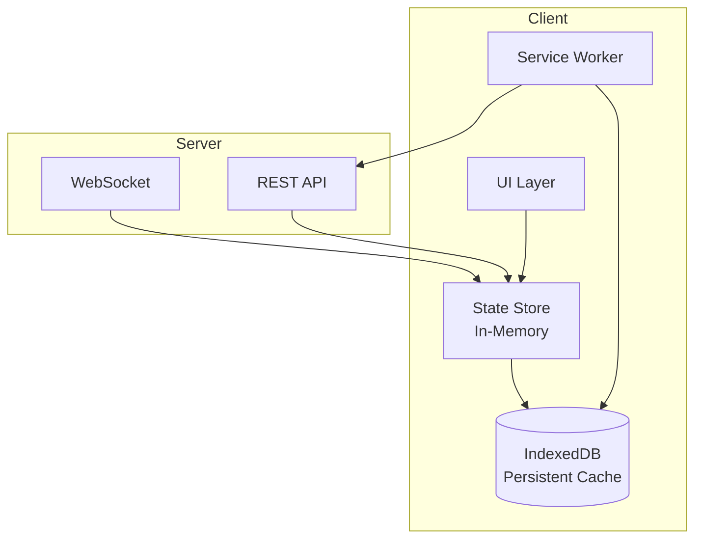

### 6.2 Cache Strategy

| Data | Cache Location | TTL | Strategy |
|------|---------------|-----|----------|
| Recent messages (last 50 per chat) | IndexedDB + Memory | Until evicted | Write-through |
| Chat list + metadata | IndexedDB + Memory | Session | Refresh on reconnect |
| User profiles | IndexedDB + Memory | 1 hour | Stale-while-revalidate |
| Unread counts | Memory only | Real-time | WebSocket-driven |
| Search results | Memory only | 5 minutes | Cache-aside |
| Attachments / thumbnails | IndexedDB | 7 days LRU | Lazy-load |

**Storage budget:** ~50 MB IndexedDB per user (configurable). LRU eviction for oldest chats.

### 6.3 Reconnection & Gap-Fill

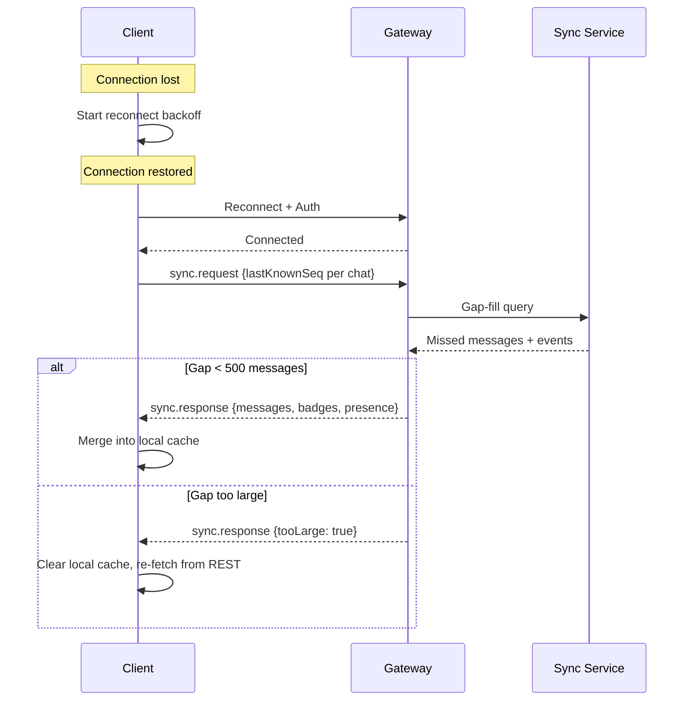

**Gap-fill details:**
- Client tracks `lastKnownSeq` per chat
- On reconnect, sends all watermarks in a single `sync.request`
- Server computes delta efficiently using sequence numbers
- If gap > 500 messages in any single chat, server returns `tooLarge` flag and client does a full refresh for that chat
- Events included in gap-fill: messages, edits, deletes, reactions, read receipts, presence changes

### 6.4 Optimistic Updates

For responsiveness, the client applies changes locally before server confirmation:

```
1. User sends message
2. Client immediately adds message to UI with status: "sending"
3. Client sends message.send via WebSocket
4. On ack: Update status to "sent", replace temp ID with server ID
5. On error: Show retry option, mark message as "failed"
6. On message.new from server for same id: No-op (already displayed)
```

**Applies to:**
- Sending messages (shown immediately with spinner)
- Reactions (toggled immediately)
- Read marks (badge cleared immediately)
- Message edits (shown immediately)
- Message deletes (hidden immediately)

**Conflict handling:**
- Server is authoritative for message content and ordering
- If optimistic update conflicts with server response, server wins
- Client replays server state on conflict

### 6.5 Offline Mode

When no WebSocket connection is available:

- **Reading**: All cached messages are available in IndexedDB. User can browse recent conversations.
- **Composing**: Messages are queued in IndexedDB with status "pending". Sent automatically on reconnect.
- **Search**: Local search over cached messages only (with clear "offline results" indicator).
- **Indicator**: Show "You're offline. Messages will be sent when you reconnect." banner.

---

## 7. Scaling Strategy

### 7.1 Connection Scaling

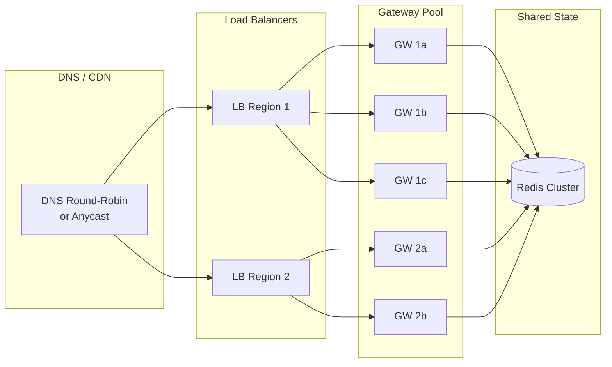

**Capacity planning:**

| Tier | Concurrent Connections | Gateway Instances | Redis Nodes |
|------|----------------------|-------------------|-------------|
| Small (< 10K users) | ~5K | 2 | 1 primary + 1 replica |
| Medium (10K-100K) | ~50K | 5-10 | 3 primary + 3 replica |
| Large (100K-1M) | ~500K | 20-50 | 6 primary + 6 replica (cluster) |

**Per gateway:** ~10K concurrent WebSocket connections (tuned for 4 CPU, 8 GB RAM).

### 7.2 Message Fan-Out

The critical scaling challenge: a message sent to a 1000-member channel must be delivered to all 1000 connected clients.

**Strategy: Pub/Sub with topic-per-chat**

```
Topic: chat:{chatId}
Subscribers: All gateway instances with connected members of that chat

1. Sender's gateway publishes message to chat:{chatId}
2. All gateways subscribed to chat:{chatId} receive the message
3. Each gateway delivers to locally-connected members
```

**Optimizations:**
- **Small chats (< 50 members):** Direct fan-out via pub/sub topic. Each gateway checks local connection registry.
- **Large channels (50+ members):** Use a dedicated fan-out worker. Gateway publishes once; worker handles member list lookup and per-gateway routing.
- **Broadcast channels (read-only, 1000+ members):** Pre-computed gateway-to-member mapping. Single pub/sub message per gateway, not per user.

### 7.3 Rate Limiting

| Action | Limit | Window | Response |
|--------|-------|--------|----------|
| Messages sent | 10 / second | Per user | 429 + backoff |
| Typing indicators | 1 / second | Per user per chat | Silently dropped |
| Read marks | 5 / second | Per user | Coalesced |
| Presence updates | 1 / 10 seconds | Per user | Coalesced |
| Search queries | 5 / second | Per user | 429 + backoff |
| WS connections | 5 | Per user total | Oldest disconnected |
| File uploads | 10 / minute | Per user | 429 |
| Urgent messages | 3 / hour | Per user | Rejected with error |

**Implementation:** Token bucket algorithm in Redis. Each action type has its own bucket keyed by `ratelimit:{userId}:{action}`.

### 7.4 Backpressure Handling

When a client can't keep up with incoming messages (e.g., in a very active channel):

1. **Gateway buffering:** Each connection has a 1000-frame send buffer. If buffer fills, start dropping non-essential frames (typing indicators first, then presence, then reactions).
2. **Priority queue:** Messages > badges > receipts > typing > presence. Essential frames are never dropped.
3. **Client-side throttling:** If rendering can't keep up, batch incoming messages and render in chunks (every 100ms).
4. **Server-side throttling for large channels:** If a channel produces > 100 messages/second, switch to "summary mode": batch into "X new messages" notifications instead of individual delivery.

### 7.5 Database Scaling

| Data | Storage | Scaling Strategy |
|------|---------|-----------------|
| Messages | PostgreSQL | Partition by chatId (hash) + time-based archival |
| Unread state | Redis + PostgreSQL | Redis primary, DB backup, eventual consistency |
| Presence | Redis only | TTL-based, no persistence needed |
| Search index | Elasticsearch | Shard by time (monthly indices) |
| Files | S3/Blob | CDN for reads, direct upload for writes |
| User/Chat metadata | PostgreSQL | Read replicas for high-read queries |

---

## 8. Failure Modes & Recovery

### 8.1 Failure Scenarios

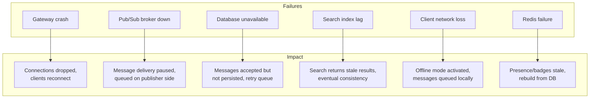

### 8.2 Recovery Procedures

| Failure | Detection | Recovery | RTO | Data Loss |
|---------|-----------|----------|-----|-----------|
| Gateway crash | Health check (5s) | LB removes; clients reconnect to healthy gateway | < 30s | None (messages in pub/sub) |
| Pub/Sub broker | Connection error from gateways | Failover to replica; gateways reconnect | < 10s | Possible message loss in transit (re-request via sync) |
| Database | Connection pool errors | Failover to replica; write queue with retry | < 60s | None (WAL ensures durability) |
| Search index | Health check + lag monitoring | Rebuild index from message store | Minutes | Search temporarily unavailable |
| Redis failure | Sentinel detection | Promote replica; rebuild caches | < 30s | Presence/badges reset (non-critical) |
| Network partition | Split-brain detection | Prefer consistency: reject writes on minority side | Varies | None (writes rejected, not lost) |

### 8.3 Data Durability Guarantees

| Data | Durability | Mechanism |
|------|-----------|-----------|
| Messages | Durable (never lost) | Persisted to DB before ack sent to sender |
| Read receipts | Best effort | Persisted on disconnect; may lag by seconds |
| Typing indicators | Ephemeral | Never persisted; lost on failure is acceptable |
| Presence | Best effort | Reconstructed from connection state on recovery |
| Unread badges | Eventually consistent | Redis primary, DB backup, reconciled on login |
| Reactions | Durable | Persisted synchronously with the reaction event |
| Search index | Derived | Rebuildable from message store |

### 8.4 Graceful Degradation

When components fail, the system degrades gracefully rather than failing entirely:

| Component Down | Degraded Experience |
|----------------|-------------------|
| Search | Search bar shows "Search temporarily unavailable"; messaging continues |
| Presence | All users show "unknown" status; messaging continues |
| Push notifications | No mobile/desktop push; in-app notifications still work via WS |
| Typing indicators | Not shown; messages still delivered normally |
| File service | File upload/download fails; text messaging continues |
| Read receipts | Checkmarks not updated; messages still delivered |

---

## 9. Technology Recommendations

### 9.1 Recommended Stack

| Component | Recommendation | Alternatives | Rationale |
|-----------|---------------|-------------|-----------|
| WS Gateway | Node.js (ws/uWebSockets.js) or Go | Rust (tokio-tungstenite) | High per-connection efficiency; mature ecosystem |
| Pub/Sub | Redis Streams | NATS, Kafka | Sufficient throughput for < 1M users; simple ops |
| Message Store | PostgreSQL | CockroachDB | ACID, partitioning, battle-tested |
| Cache | Redis | Memcached, Dragonfly | Pub/sub + cache in one; rich data structures |
| Search | Elasticsearch | Meilisearch, Typesense | Full-text + faceted search; scales well |
| File Store | S3-compatible | Azure Blob, MinIO | Standard; CDN integration |
| Push | Firebase (FCM) + APNs | OneSignal | Direct control; widest device coverage |
| Load Balancer | nginx / HAProxy | Envoy, cloud LB | WebSocket-aware; sticky sessions |

### 9.2 Tradeoffs

**Redis Streams vs. Kafka:**
- Redis: Lower latency (~1ms), simpler ops, sufficient for < 1M concurrent users. No durable replay beyond retention window.
- Kafka: Higher throughput, durable log, better for > 1M users. Higher operational complexity and latency (~10ms).
- **Decision:** Start with Redis Streams. Migrate to Kafka if scaling requires it.

**PostgreSQL vs. NoSQL (Cassandra/ScyllaDB):**
- PostgreSQL: Strong consistency, rich queries, JSONB for flexible schemas. Scaling via partitioning + read replicas.
- Cassandra: Write-optimized, linear scaling. Eventual consistency, limited query flexibility.
- **Decision:** PostgreSQL for correctness guarantees on messaging. Evaluate NoSQL only if write throughput exceeds PostgreSQL capacity (unlikely for < 10M messages/day).

**Server-Sent Events vs. WebSocket:**
- SSE: Simpler, HTTP-based, automatic reconnection. Unidirectional (server -> client only).
- WebSocket: Bidirectional, lower overhead for high-frequency updates. More complex connection management.
- **Decision:** WebSocket. Bidirectional requirement (typing indicators, message sending) makes SSE insufficient.

### 9.3 Protocol Versioning

- WebSocket protocol includes a `version` field in the initial handshake
- Server supports N-1 and N versions simultaneously during rollout
- Clients that connect with an unsupported version receive an `error` frame with `code: "UPGRADE_REQUIRED"` and a link to the latest client

---

## 10. Security Considerations

### 10.1 Transport Security

- All WebSocket connections over WSS (TLS 1.3)
- Certificate pinning for mobile clients
- CORS restricted to known origins for web clients

### 10.2 Authentication

- JWT with short expiry (15 min) + refresh token (7 days)
- Token validated on every WS connection and HTTP request
- Refresh happens over HTTPS, not over the WebSocket
- Session revocation propagates to gateways within 30 seconds via pub/sub

### 10.3 Authorization

- Every frame validated against user's chat/channel membership
- Admin actions (delete others' messages, manage channels) require elevated permissions
- Rate limiting prevents abuse (see Section 7.3)

### 10.4 Data Protection

- Messages encrypted at rest (database-level encryption)
- End-to-end encryption as optional feature for 1:1 chats (Signal protocol)
- File uploads scanned for malware before indexing
- PII in search indices follows data retention policies
- GDPR: User data export and deletion supported

---

## 11. Monitoring & Observability

### 11.1 Key Metrics

| Metric | Target | Alert Threshold |
|--------|--------|----------------|
| WS connection count | Monitor | > 80% capacity |
| Message delivery latency (p99) | < 200ms | > 500ms |
| Message delivery success rate | > 99.9% | < 99.5% |
| Search query latency (p99) | < 500ms | > 2s |
| Search index lag | < 5s | > 30s |
| Pub/sub consumer lag | < 100 messages | > 1000 messages |
| Gateway memory usage | < 70% | > 85% |
| Unack'd message queue depth | < 1000 | > 5000 |
| WebSocket error rate | < 0.1% | > 1% |
| Push notification delivery rate | > 95% | < 90% |

### 11.2 Distributed Tracing

- Every message carries a `traceId` from client through gateway, router, storage, and back
- Spans: `client -> gateway -> router -> db -> gateway -> recipient_client`
- Tool: OpenTelemetry with Jaeger or Grafana Tempo

### 11.3 Logging

- Structured JSON logs from all services
- Log levels: ERROR (alerts), WARN (investigate), INFO (audit), DEBUG (development only)
- Sensitive data (message content) never logged; only metadata (chatId, messageId, userId)
- Retention: 30 days hot, 1 year cold storage

---

## 12. "New Messages" Indicator

The Teams-like "New messages" indicator at the bottom of the chat viewport:

### 12.1 Behavior

```
When user is scrolled up (not at bottom of chat):
  - New messages arrive but are NOT auto-scrolled to
  - A floating indicator appears at bottom: "↓ New messages"
  - Badge shows count of new messages since scroll-away
  - Clicking the indicator scrolls to the newest message
  - If user manually scrolls to bottom, indicator dismisses

When user is at bottom of chat:
  - New messages auto-scroll into view
  - No indicator shown
```

### 12.2 Implementation

```typescript
interface NewMessagesIndicator {
  visible: boolean;
  count: number;
  firstNewMessageId: string;   // Scroll target

  // Triggered by:
  // - message.new received while scrollPosition < maxScroll - threshold
  // Dismissed by:
  // - User scrolls to bottom (within 50px threshold)
  // - User clicks the indicator
  // - User sends a message (auto-scrolls to bottom)
}
```

This is entirely a client-side UI concern. The server delivers `message.new` frames regardless of scroll position; the client decides whether to auto-scroll or show the indicator.
